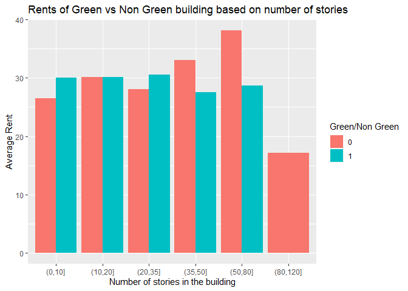

HM2 Q1
================

## Reading the file

``` r
rm(list = ls())
library(dplyr)
```

    ## 
    ## Attaching package: 'dplyr'

    ## The following objects are masked from 'package:stats':
    ## 
    ##     filter, lag

    ## The following objects are masked from 'package:base':
    ## 
    ##     intersect, setdiff, setequal, union

``` r
library(magrittr)
library(ggplot2)
filename = 'greenbuildings.csv'
setwd("D:/Summer Semester/Intro to Predictive Modelling/Unsupervised/data")
green =  read.csv(filename,header = TRUE)
head(green)
```

    ##   CS_PropertyID cluster   size empl_gr  Rent leasing_rate stories age
    ## 1        379105       1 260300    2.22 38.56        91.39      14  16
    ## 2        122151       1  67861    2.22 28.57        87.14       5  27
    ## 3        379839       1 164848    2.22 33.31        88.94      13  36
    ## 4         94614       1  93372    2.22 35.00        97.04      13  46
    ## 5        379285       1 174307    2.22 40.69        96.58      16   5
    ## 6         94765       1 231633    2.22 43.16        92.74      14  20
    ##   renovated class_a class_b LEED Energystar green_rating net amenities
    ## 1         0       1       0    0          1            1   0         1
    ## 2         0       0       1    0          0            0   0         1
    ## 3         1       0       1    0          0            0   0         1
    ## 4         1       0       1    0          0            0   0         0
    ## 5         0       1       0    0          0            0   0         1
    ## 6         0       1       0    0          0            0   0         1
    ##   cd_total_07 hd_total07 total_dd_07 Precipitation  Gas_Costs
    ## 1        4988         58        5046         42.57 0.01370000
    ## 2        4988         58        5046         42.57 0.01373149
    ## 3        4988         58        5046         42.57 0.01373149
    ## 4        4988         58        5046         42.57 0.01373149
    ## 5        4988         58        5046         42.57 0.01373149
    ## 6        4988         58        5046         42.57 0.01373149
    ##   Electricity_Costs cluster_rent
    ## 1        0.02900000        36.78
    ## 2        0.02904455        36.78
    ## 3        0.02904455        36.78
    ## 4        0.02904455        36.78
    ## 5        0.02904455        36.78
    ## 6        0.02904455        36.78

``` r
attach(green)
```

The analysis done by ‘excel guru’ have a few issues. Let’s go through
them one by one

## ISSUE 1

Challenging the removal of buildings with occupancy rate less than 10%

``` r
plot(leasing_rate,Rent)
```


From the scatter plot above, we can see that there isn’t anything weird
going on in terms of rent in the buildings with occupany less than 10%.
These buildings also have a good range of rents which lead upto 50$ per
sqft. So we should consider these buildings in our analysis as well.

## ISSUE 2

The excel guru took the medians between the green buildings and non
green buildings. He missed taking a few factors under consideration.

One such factor is the class of the building. Let’s start by creating a
single class column which tells us which class the building is in. And
then we plot a box plot for all three
classes

``` r
green$class = ifelse(green$class_a == 1, 'Class A', ifelse(green$class_b == 1, 'Class B', 'Class C'))
boxplot(Rent~green$class)
```


From the box plot above we can see that the rent is different for
different classes.With buildings in Class A having the highest rent and
Class C buildings having the least rent

Hence the rent of the building depends on the building quality. Let’s
see how the premiums for green and non green buildings change when class
is kept constant

``` r
class_groupby = green %>%
  group_by(class,green_rating)%>%
  summarize(mean_rent = mean(Rent),n=n())


ggplot(class_groupby,aes(x=class,y = mean_rent,fill=factor(green_rating)))+
  geom_bar(stat = 'identity', position = 'dodge')+
  labs(x = 'Class of Building')+
  labs(y = 'Average Rent')+
  labs(title = 'Comparing the rents of green vs non green buildings based on class')+
  labs(fill = 'Green/Non Green')
```


From the graph above we can see that for high quality buildings, the
average rent for green buildings is less than the average rent of non
green buildings. And for low quality buildings (Class C), the green
buildings have a premium.

Hence it is important to know the quality of material we are going to
use for the project

## ISSUE 3

Similar to class, the excel guru forgot to take the age into account.
Buildings which are younger tend to charge higher than buildings which
are old. And since green buildings are relatively new concepts, their
relative age might be less and this might be the reason for the
difference in rent

Let’s confirm our hypothesis:

Plotting density histograms for green buildings and non green buildings

``` r
ggplot(green)+
  geom_histogram(aes(x = age, y = stat(density),fill=factor(green_rating)),binwidth = 5,)+
  labs(x = 'Age of the building')+
  labs(y = 'Density')+
  labs(title= 'Histogram for age of the building - Green vs Non Green')+
  labs(fill = 'Green/Non Green')
```


From the charts above we can see that our hypothesis is confirmed. There
are more number of non green buildings which are older than 50 years
when compared to green buildings.

Let’s see how the premium between buildings vary if the age is kept
constant

``` r
green$agebins = cut(age,c(-1,10,30,50,90,200))

agebins_groupby = green %>%
  group_by(agebins,green_rating)%>%
  summarize(mean_rent = mean(Rent),n=n())


ggplot(agebins_groupby,aes(x=agebins,y = mean_rent,fill=factor(green_rating)))+
  geom_bar(stat = 'identity', position = 'dodge')+
  labs(x = 'Age of the building bins')+
  labs(y = 'Average Rent')+
  labs(title = 'Rents of Green vs Non Green building based on age')+
  labs(fill = 'Green/Non Green')
```


From the chart above, we can see that for younger buildings, non green
buildings have a premium and as the age of the building increases the
rent for green buildings is higher.

## ISSUE 4

The excel guru did not take into consideration if the project has any
amenities planned or not. Green houses with amenities and without
amenities have a different premium over non green houses

``` r
green$amenities = ifelse(amenities==1, 'Yes', 'No')

amenities_groupby = green %>%
  group_by(amenities,green_rating)%>%
  summarize(mean_rent = mean(Rent),n=n())


ggplot(amenities_groupby,aes(x=amenities, mean_rent,fill=factor(green_rating)))+
  geom_bar(stat = 'identity', position = 'dodge')+
  labs(x = 'Amenities Provided')+
  labs(y = 'Average Rent')+
  labs(title = 'Comparing the rents of green vs non green buildings based on amenities provided')+
  labs(fill = 'Green/Non Green')
```


From the chart above, we can see that with amenities provided the green
and non green buildings will get almost the same rent

## Issue 5

The excel guru failed to take the neighborhood into account. The premium
of green houses over non green houses might depend on the neighborhood
the buildings are in.

There are a total of 685 clusters which are a lot to look at. Let’s
group them together based on the ‘cluster\_rent’ to get fewer clusters.
The cluster\_rent column can act as a proxy for neighborhood because the
rent of the cluster will depend on the geographical location of the
cluster.

From the graph below, we can see that the green buildings are more left
skewed than the non green buildings.

``` r
ggplot(green)+
  geom_histogram(aes(x = cluster_rent, y = stat(density),fill=factor(green_rating)),binwidth = 5,)+
  labs(x = 'Cluster Rent')+
  labs(y = 'Density')+
  labs(title= 'Histogram for the Neighborhood - Green vs Non Green')+
  labs(fill = 'Green/Non Green')
```


Now let’s bucket the buildings based on cluster rent

``` r
green$nbhdbins = cut(cluster_rent,c(0,20,30,40,60,100))

nbhdbins_groupby = green %>%
  group_by(nbhdbins,green_rating)%>%
  summarize(mean_rent = mean(Rent),n=n())


ggplot(nbhdbins_groupby,aes(x=nbhdbins,y = mean_rent,fill=factor(green_rating)))+
  geom_bar(stat = 'identity', position = 'dodge')+
  labs(x = 'Cluster rent bins')+
  labs(y = 'Average Rent')+
  labs(title = 'Rents of Green vs Non Green building based on Nbhd')+
  labs(fill = 'Green/Non Green')
```


From the chart above, we can see that based on the neighborhood the East
Cesar Chavez is in, the premium for Green buildings over Non Green
buildings will differ.

## Issue 6

The excel guru missed the fact that the number of stories in the
building also matters.Let’s check if the number of stories should be
considered or not

``` r
green$strybins = cut(stories,c(0,10,20,35,50,80,120))

strybins_groupby = green %>%
  group_by(strybins,green_rating)%>%
  summarize(mean_rent = mean(Rent),n=n())


ggplot(strybins_groupby,aes(x=strybins,y = mean_rent,fill=factor(green_rating)))+
  geom_bar(stat = 'identity', position = 'dodge')+
  labs(x = 'Number of stories in the building')+
  labs(y = 'Average Rent')+
  labs(title = 'Rents of Green vs Non Green building based on number of stories')+
  labs(fill = 'Green/Non Green')
```



From the chart above we can see that for a few bins, green houses have a
premium and for a few bins they don’t. Hence the excel guru should have
taken care of this fact as well.

In conclusion, there are a lot of factors which can impact the rent of
the building such as the Neighborhood, Building quality (class),
Amenities planned etc have not been provided. Hence it is a tough call
to make.

But with the details provided, I would recommend not going ahead with
the green buildings as most of the difference in the rent between green
and non green buildings is because of the skew in age and class
distribution of these two groups.
