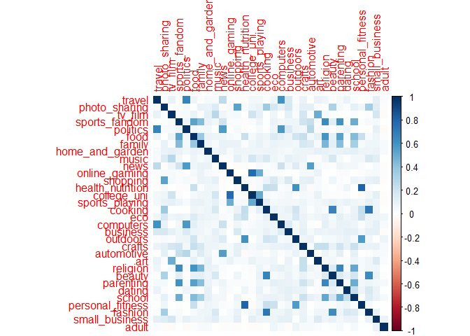
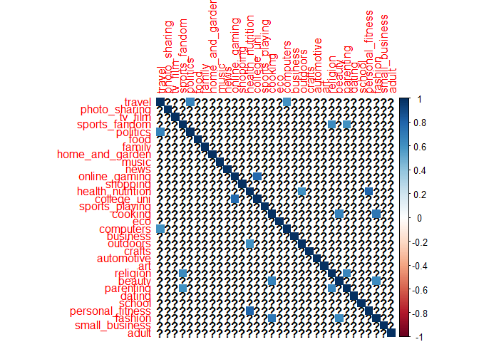
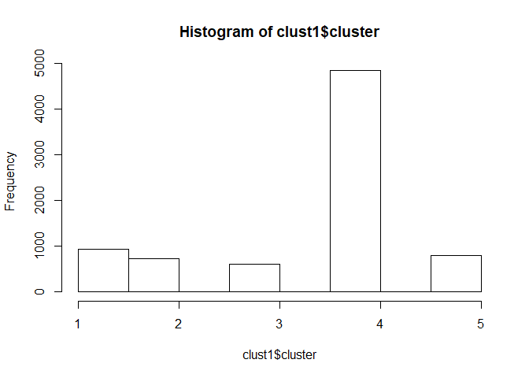
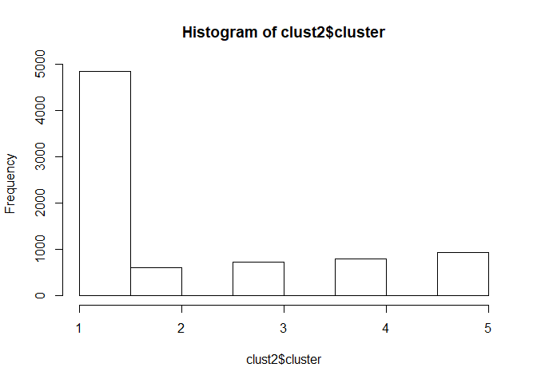
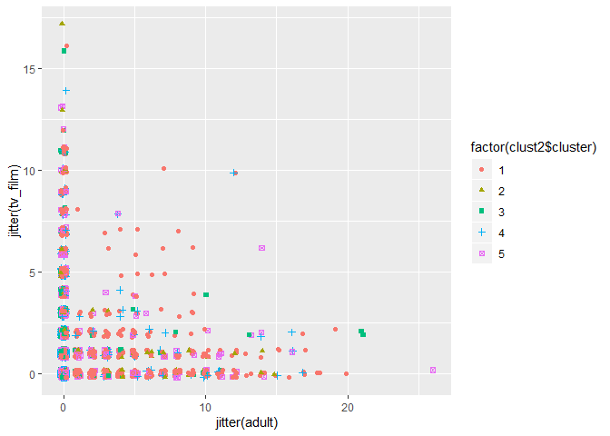
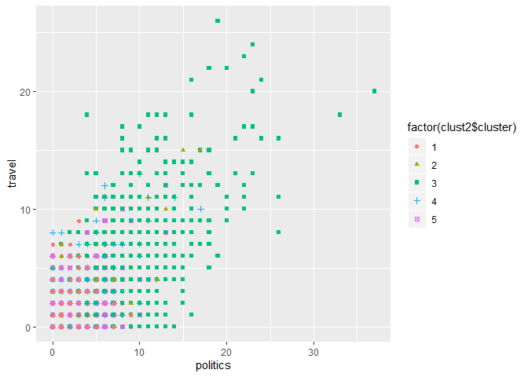
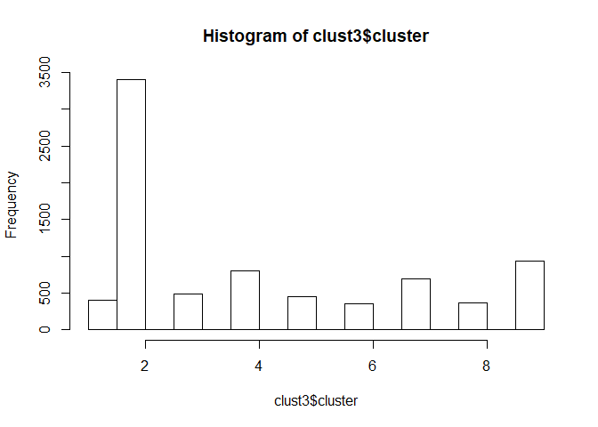

# **Market Segmentation**

### Libraries used

```
## 
## Attaching package: 'dplyr'
```

```
## The following objects are masked from 'package:stats':
## 
##     filter, lag
```

```
## The following objects are masked from 'package:base':
## 
##     intersect, setdiff, setequal, union
```


### Importing data from the social_marketing.csv file

```r
data = read.csv("social_marketing.csv", na.strings = '')
```

## Data Cleaning and checking for null values in the data- False. No null values to drop

```r
any(is.na(data))
```

```
## [1] FALSE
```

### Removing categories that are slip through

```r
data=data[,-1]
data$spam=NULL
data$chatter=NULL
data$uncategorized=NULL
```

### Checking for duplicate values


### Removing labels, centering and scaling

```r
data = data[-1]
dataImproved = scale(data, center=TRUE, scale=TRUE)
```


## Correlations
### Finding the correlations among various variables

```r
#install.packages("corrplot")
library(corrplot)
```

```
## corrplot 0.84 loaded
```

```r
corOfSegments = cor(dataImproved)
corrplot(corOfSegments, method='color')
```

<!-- -->

```r
corOfSegments[abs(corOfSegments) < 0.6] = NA
corrplot(corOfSegments,method='color')
```

<!-- -->

1. There appears to be an extremely high correlation between personal fitness with health_nutrition

2. There is high correlation among online gaming and college&universities; computers and travel; fashion, beauty and cooking

3. There is a correlation among outdoors, health_nutrition and personal_fitness

## Clustering
### Extract the centers and scales from the rescaled data (which are named attributes)

### Running k-means clustering with 5 clusters, 100 starts. Chose 5 r as a random figure


```r
set.seed(123456)
clust1 = kmeans(dataImproved, 5, nstart=100)
hist(clust1$cluster)
```

<!-- -->

```r
clust1$size
```

```
## [1]  929  721  604 4838  790
```

```r
clust1$centers
```

```
##        travel photo_sharing     tv_film sports_fandom   politics
## 1 -0.14904863 -0.0009088478 -0.03069181    -0.2036555 -0.1813412
## 2  1.72599648 -0.0672160541  0.08471967     0.1801757  2.3118515
## 3 -0.03646778  1.2359721276  0.04546021    -0.2028687 -0.1312732
## 4 -0.20793768 -0.1396899777 -0.01670330    -0.2847408 -0.2600427
## 5 -0.09866866 -0.0270885546  0.02630682     1.9739217 -0.2038018
##          food      family home_and_garden       music        news
## 1  0.41026776 -0.06228435      0.16553264  0.07415623 -0.05274520
## 2  0.01984975  0.05162019      0.12536787 -0.04814322  1.89798830
## 3 -0.17724378  0.04856877      0.14497717  0.56856607 -0.07655708
## 4 -0.34726378 -0.23477100     -0.09989864 -0.09176903 -0.25063641
## 5  1.76160380  1.42674755      0.19186502  0.08403138 -0.07674663
##   online_gaming    shopping health_nutrition  college_uni sports_playing
## 1   -0.01522169  0.04658184       2.07522219 -0.086372105     0.05208660
## 2   -0.01113022 -0.00899759      -0.20328140  0.040129790     0.06135337
## 3    0.08308535  0.37876921      -0.07239981  0.141217686     0.27653290
## 4   -0.01040772 -0.06247869      -0.33285221 -0.006448388    -0.08058872
## 5    0.02827195  0.04646584      -0.16107221 -0.003534268     0.16485837
##      cooking        eco   computers    business    outdoors     crafts
## 1  0.3667602  0.5175227 -0.08395417  0.06499705  1.58854115  0.1037978
## 2 -0.2158197  0.1056396  1.53579439  0.35825329  0.11317795  0.1597185
## 3  2.5240685  0.0851058  0.07995539  0.28302775  0.03595716  0.1609751
## 4 -0.3344214 -0.1561627 -0.23557191 -0.11960632 -0.31505789 -0.1752888
## 5 -0.1161022  0.1862869  0.07859431  0.11268827 -0.06939759  0.6825739
##    automotive         art    religion     beauty    parenting      dating
## 1 -0.11656981  0.02024334 -0.17237471 -0.2132625 -0.109339487  0.17551083
## 2  1.08596200  0.01311373 -0.04765248 -0.1811266 -0.001177008  0.19257269
## 3  0.05788151  0.13534089 -0.12937190  2.3490818 -0.084662079  0.14085941
## 4 -0.17291777 -0.04054599 -0.29734420 -0.2720133 -0.301507290 -0.08652929
## 5  0.16067154  0.10905638  2.16605747  0.2859088  2.040826797  0.04006980
##        school personal_fitness    fashion small_business        adult
## 1 -0.15326847       2.03973982 -0.1093949    -0.06870792  0.004933877
## 2 -0.04611772      -0.19210751 -0.1748712     0.22325641 -0.074797710
## 3  0.17738408      -0.04549079  2.4313325     0.28619265 -0.006032731
## 4 -0.25016110      -0.33905801 -0.2583613    -0.07496615  0.009428350
## 5  1.61870465      -0.11211352  0.0115658     0.11732618  0.009335433
```


```r
#clust1$center  # not super helpful
#clust1$center[1,]*sigma + mu
#clust1$center[2,]*sigma + mu
#clust1$center[4,]*sigma + mu
```


```r
# Which variables are in which clusters?
#which(clust1$cluster == 1)
#which(clust1$cluster == 2)
#which(clust1$cluster == 3)
#which(clust1$cluster == 4)
#which(clust1$cluster == 5)
```


```r
##qplot(chatter, travel, data=data, color=factor(clust1$cluster))
```
***

## **kmeans plus plus**


```r
set.seed(123456)
clust2 = kmeanspp(dataImproved, k=5, nstart=100)
hist(clust2$cluster)
```

<!-- -->

```r
clust2$size
```

```
## [1] 4838  604  721  790  929
```

###Data must be standardized (i.e., scaled) to make variables comparable


```r
mu = attr(dataImproved,"scaled:center")
sigma = attr(dataImproved,"scaled:scale")
clusters_unscaled = clust2$centers * sigma + mu
```


> Analysis for k =5 (5 clusters)
 
### Cluster 1


```r
library(ggplot2)
print(paste0("Cluster size1: ",length(which(clust2$cluster==1))))
```

```
## [1] "Cluster size1: 4838"
```

```r
rbind(clust2$centers[1, ], clusters_unscaled[1, ])
```

```
##          travel photo_sharing    tv_film sports_fandom   politics
## [1,] -0.2079377      -0.13969 -0.0167033    -0.2847408 -0.2600427
## [2,]  1.1097561       1.14946  1.1639407     1.0215796  0.3034437
##            food    family home_and_garden       music       news
## [1,] -0.3472638 -0.234771     -0.09989864 -0.09176903 -0.2506364
## [2,]  0.3951106  0.191213      1.37813894  0.58474576  0.8233474
##      online_gaming    shopping health_nutrition  college_uni
## [1,]   -0.01040772 -0.06247869       -0.3328522 -0.006448388
## [2,]    0.41603674  0.97577123        0.6614746  2.679163630
##      sports_playing    cooking        eco  computers   business   outdoors
## [1,]    -0.08058872 -0.3344214 -0.1561627 -0.2355719 -0.1196063 -0.3150579
## [2,]     0.77259533  0.7844514  0.3921042  0.5080387  0.4976802 -0.1680107
##          crafts automotive         art   religion     beauty  parenting
## [1,] -0.1752888 -0.1729178 -0.04054599 -0.2973442 -0.2720133 -0.3015073
## [2,]  1.2573119  0.8422694  0.59962457  0.4230366  0.3439438  0.4452948
##           dating     school personal_fitness    fashion small_business
## [1,] -0.08652929 -0.2501611        -0.339058 -0.2583613    -0.07496615
## [2,]  0.92675339  0.3363885         1.042788  0.3443488     0.60265302
##           adult
## [1,] 0.00942835
## [2,] 0.77890188
```

#### Analysis:
#### People in this cluster dont seem to have any common interests that stands out. Adult is close to 0 and rest of the centers are negative
#### Latent factor: No specific factors can be made, adult is the only positive value


```r
qplot(jitter(adult), jitter(tv_film), data=data, color=factor(clust2$cluster),shape = factor(clust2$cluster))
```

<!-- -->


### Cluster 2


```r
print(paste0("Cluster size2: ",length(which(clust2$cluster==2))))
```

```
## [1] "Cluster size2: 604"
```

```r
rbind(clust2$centers[2, ], clusters_unscaled[2, ])
```

```
##           travel photo_sharing    tv_film sports_fandom   politics
## [1,] -0.03646778      1.235972 0.04546021    -0.2028687 -0.1312732
## [2,]  2.59716537      2.263682 1.47159869     0.3561534  0.6505266
##            food     family home_and_garden     music        news
## [1,] -0.1772438 0.04856877       0.1449772 0.5685661 -0.07655708
## [2,]  0.3949503 0.49139999       2.2280746 2.3999639  0.56449514
##      online_gaming  shopping health_nutrition college_uni sports_playing
## [1,]    0.08308535 0.3787692      -0.07239981   0.1412177      0.2765329
## [2,]    0.88315969 1.2081197       0.86419776   1.3045363      0.7243994
##        cooking       eco  computers  business   outdoors    crafts
## [1,]  2.524068 0.0851058 0.07995539 0.2830278 0.03595716 0.1609751
## [2,] 13.915817 0.7494522 0.85510938 1.1040089 1.66718495 1.6833084
##      automotive       art   religion   beauty   parenting    dating
## [1,] 0.05788151 0.1353409 -0.1293719 2.349082 -0.08466208 0.1408594
## [2,] 1.36438477 2.4624350  0.4101818 4.481041  0.28400236 1.8983972
##         school personal_fitness  fashion small_business        adult
## [1,] 0.1773841      -0.04549079 2.431332      0.2861927 -0.006032731
## [2,] 0.8619774       1.41768598 2.106646      1.6434174  1.447555274
```

#### Analysis:
1. Fashion
2. Small Business
3. School

#### Latent factor: Could be teenages-youngsters people, interested in Fashion, entrepreneurship and School


### Cluster 3


```r
print(paste0("Cluster size3: ",length(which(clust2$cluster==3))))
```

```
## [1] "Cluster size3: 721"
```

```r
rbind(clust2$centers[3, ], clusters_unscaled[3, ])
```

```
##        travel photo_sharing    tv_film sports_fandom politics       food
## [1,] 1.725996   -0.06721605 0.08471967     0.1801757 2.311851 0.01984975
## [2,] 3.933341    0.47116255 2.94815366     0.8615826 4.492153 0.79128520
##          family home_and_garden       music     news online_gaming
## [1,] 0.05162019       0.1253679 -0.04814322 1.897988   -0.01113022
## [2,] 1.70298328       1.6200858  1.07944705 8.508211    0.50676723
##         shopping health_nutrition college_uni sports_playing    cooking
## [1,] -0.00899759       -0.2032814  0.04012979     0.06135337 -0.2158197
## [2,]  0.90770519        0.2106782  1.68072884     0.74246410  0.9242168
##            eco computers  business outdoors    crafts automotive
## [1,] 0.1056396  1.535794 0.3582533 0.113178 0.1597185   1.085962
## [2,] 0.4963855  4.036192 2.3237521 3.005924 1.0447581   3.353706
##             art    religion     beauty    parenting    dating      school
## [1,] 0.01311373 -0.04765248 -0.1811266 -0.001177008 0.1925727 -0.04611772
## [2,] 0.52240049  0.76476504  0.3880297  0.401189610 2.3723420  1.10864840
##      personal_fitness    fashion small_business       adult
## [1,]       -0.1921075 -0.1748712      0.2232564 -0.07479771
## [2,]        0.4517737  0.5711656      1.0016138  0.85981341
```
#### Analysis:
1. Politics
2. News
3. Travel

#### Latent factor: Could be typically middle aged, working folks interested in Politics, news and travel 


```r
qplot(politics, news, data=data, color=factor(clust2$cluster),shape = factor(clust2$cluster))
```

<!-- -->

```r
qplot(politics, travel, data=data, color=factor(clust2$cluster),shape = factor(clust2$cluster))
```

<!-- -->

The  scatterplot gives out information that  posts on politics, news and travel are put into the green cluster which is 3

# Cluster 4


```r
print(paste0("Cluster size4: ",length(which(clust2$cluster==4))))
```

```
## [1] "Cluster size4: 790"
```

```r
rbind(clust2$centers[4, ], clusters_unscaled[4, ])
```

```
##           travel photo_sharing    tv_film sports_fandom   politics
## [1,] -0.09866866   -0.02708855 0.02630682      1.973922 -0.2038018
## [2,]  1.38079684    0.65136761 1.62569476      1.789945  0.7051616
##          food   family home_and_garden      music        news
## [1,] 1.761604 1.426748        0.191865 0.08403138 -0.07674663
## [2,] 5.699153 6.593953        1.081166 1.54136800  0.45323273
##      online_gaming   shopping health_nutrition  college_uni sports_playing
## [1,]    0.02827195 0.04646584       -0.1610722 -0.003534268      0.1648584
## [2,]    0.86848927 0.79367843        0.1112312  1.777919558      1.5518628
##         cooking       eco  computers  business    outdoors    crafts
## [1,] -0.1161022 0.1862869 0.07859431 0.1126883 -0.06939759 0.6825739
## [2,]  0.5259182 1.0079802 0.80951658 1.2026151  0.95517117 1.0235263
##      automotive       art religion    beauty parenting    dating   school
## [1,]  0.1606715 0.1090564 2.166057 0.2859088  2.040827 0.0400698 1.618705
## [2,]  3.2896442 0.7777007 4.254570 1.1074324  6.249374 1.4686342 5.559042
##      personal_fitness   fashion small_business       adult
## [1,]       -0.1121135 0.0115658      0.1173262 0.009335433
## [2,]        1.6136811 0.5253064      1.0991310 0.342106624
```

#### Analysis:
1. Religion
2. Parenting
3. Sports Fandom

#### Latent factor: Could be  young/new/middle aged parents, tweeting on religion, parenting and travel 

# Cluster 5


```r
print(paste0("Cluster size5: ",length(which(clust2$cluster==5))))
```

```
## [1] "Cluster size5: 929"
```

```r
rbind(clust2$centers[5, ], clusters_unscaled[5, ])
```

```
##          travel photo_sharing     tv_film sports_fandom   politics
## [1,] -0.1490486 -0.0009088478 -0.03069181    -0.2036555 -0.1813412
## [2,]  1.3368490  1.2036223015  0.60923750     0.5363515  0.4643475
##           food      family home_and_garden      music       news
## [1,] 0.4102678 -0.06228435       0.1655326 0.07415623 -0.0527452
## [2,] 1.7467131  0.96697048       0.6426265 2.90065892  0.5868633
##      online_gaming   shopping health_nutrition college_uni sports_playing
## [1,]   -0.01522169 0.04658184         2.075222 -0.08637211      0.0520866
## [2,]    0.70001115 0.82304986         6.327985  1.24412932      1.3488112
##        cooking       eco   computers   business outdoors    crafts
## [1,] 0.3667602 0.5175227 -0.08395417 0.06499705 1.588541 0.1037978
## [2,] 3.2561895 0.9385961  0.79411910 0.37651368 5.026718 0.7861824
##      automotive        art   religion     beauty  parenting    dating
## [1,] -0.1165698 0.02024334 -0.1723747 -0.2132625 -0.1093395 0.1755108
## [2,]  1.2117591 0.43725890  0.7653391  0.9491171  2.3981156 1.0626439
##          school personal_fitness    fashion small_business       adult
## [1,] -0.1532685         2.039740 -0.1093949    -0.06870792 0.004933877
## [2,]  1.1121291         2.082345  0.6804155     0.58839883 0.412271259
```

#### Analysis:
1. Personal fitness
2. Health nutrition
3. Outdoors

#### Latent factor: Could be  young, fitness enthusiastic people, tweeting on fitness, nutrition and outdoors

### **K =5 gave us only few segregations, with no specific common triats.**
### To make a more reasonable analysis, K= 9 is being chosen
 

***

## K=9


```r
clust3 = kmeanspp(dataImproved, k=9, nstart=100)
hist(clust3$cluster)
```

<!-- -->

```r
clust3$size
```

```
## [1]  408 3395  484  804  449  358  688  367  929
```

```r
clusters_unscaled1 = clust3$centers * sigma + mu
```
Cluster size now is 3360

### Cluster 1


```r
print(paste0("Cluster size1: ",length(which(clust3$cluster==1))))
```

```
## [1] "Cluster size1: 408"
```

```r
rbind(clust3$centers[1, ], clusters_unscaled1[1, ])
```

```
##         travel photo_sharing  tv_film sports_fandom    politics      food
## [1,] 0.2244711   -0.07383441 2.766502    -0.1081566 -0.09603181 0.1391788
## [2,] 2.0980392    1.05042173 2.338710     0.6391804  1.49754902 1.9527022
##          family home_and_garden     music       news online_gaming
## [1,] -0.1286727       0.3245917 0.9966975 0.01300067    -0.1743778
## [2,]  0.5151342       0.9919477 1.7058824 0.66440752     0.4000585
##        shopping health_nutrition college_uni sports_playing    cooking
## [1,] 0.04490159       -0.1588696   0.3517754      0.1060660 -0.1431135
## [2,] 1.69104030        1.8529412   1.3104438      0.4019003  0.4152496
##            eco  computers  business    outdoors    crafts automotive
## [1,] 0.1050125 -0.1554852 0.3374162 -0.07969923 0.7637251 -0.2199272
## [2,] 0.5931373  0.6857239 1.6299872  1.24520455 1.1397059  0.5944569
##           art   religion       beauty  parenting      dating      school
## [1,] 2.695690 0.01545451 -0.001294978 -0.1826181 -0.05367311 -0.02520785
## [2,] 3.916903 2.05123184  0.703431373  2.1979543  1.06458564  0.75218091
##      personal_fitness     fashion small_business       adult
## [1,]        -0.155423 -0.02225544      0.8238371 -0.01967377
## [2,]         1.088235  1.35797214      1.4428449  1.05773534
```
#### Analysis:
1. Sports fandom
2. Food
3. Family

#### Latent factor: Could be  young/middle aged people, tweeting on sports teams, food and family

### Cluster 2


```r
print(paste0("Cluster size2: ",length(which(clust3$cluster==2))))
```

```
## [1] "Cluster size2: 3395"
```

```r
rbind(clust3$centers[2, ], clusters_unscaled1[2, ])
```

```
##          travel photo_sharing    tv_film sports_fandom   politics
## [1,] -0.2185857   -0.41328185 -0.2243821    -0.3245048 -0.3022562
## [2,]  2.0997084    0.09814979  0.5112830     0.6815521  0.8608148
##            food     family home_and_garden      music       news
## [1,] -0.3640453 -0.3024224      -0.2037965 -0.2279502 -0.3148812
## [2,]  0.2840455  0.5163199       1.1192209  0.7266584  0.2052257
##      online_gaming   shopping health_nutrition college_uni sports_playing
## [1,]    -0.2311477 -0.3894956       -0.3177186  -0.2579835    -0.25514478
## [2,]     0.4930351  0.6080269        0.6290001   0.3044125    -0.05936264
##         cooking        eco  computers   business   outdoors     crafts
## [1,] -0.3296767 -0.2721859 -0.2558799 -0.2552125 -0.3256452 -0.2904016
## [2,]  0.3396973  0.3280432  0.2547934  1.0425184  1.1030941  0.4331331
##      automotive        art   religion     beauty  parenting     dating
## [1,] -0.3122828 -0.2363799 -0.3047154 -0.2728316 -0.3205176 -0.1469774
## [2,]  0.1432993  0.3465410  0.2777595  0.5079021  0.5386174  1.1235087
##          school personal_fitness    fashion small_business     adult
## [1,] -0.3151444       -0.3355104 -0.2885835     -0.2219855 0.0122982
## [2,]  0.2584340        0.3831231  0.5370284      1.2368268 0.7214818
```

#### Analysis:
1. News
2. Automotive
3. Politics

#### Latent factor: Could be  middle aged guys (not doing a gender-stereotyping here), tweeting on news, automotives and politics

### Cluster 3


```r
print(paste0("Cluster size3: ",length(which(clust3$cluster==3))))
```

```
## [1] "Cluster size3: 484"
```

```r
rbind(clust3$centers[3, ], clusters_unscaled1[3, ])
```

```
##           travel photo_sharing    tv_film sports_fandom   politics
## [1,] -0.05436815      1.241828 -0.1469996    -0.2041351 -0.1252152
## [2,]  0.98010175      3.635644  0.3957827     0.6233313  0.7220531
##            food     family home_and_garden     music        news
## [1,] -0.2052483 0.03628203       0.1373992 0.5420642 -0.07128136
## [2,]  1.2942343 0.75332998       3.0720848 2.6656086  0.69645579
##      online_gaming  shopping health_nutrition college_uni sports_playing
## [1,]    -0.0200455 0.2039401      -0.05125836 -0.01636561      0.2067942
## [2,]     1.4138512 1.7595953       0.58917448  1.06406990      2.0576380
##       cooking        eco  computers  business   outdoors     crafts
## [1,] 2.814218 0.01622251 0.07155623 0.2093348 0.03448647 0.09187782
## [2,] 7.117586 0.43447495 0.85272591 2.4231497 1.64939245 0.87453789
##      automotive         art   religion   beauty   parenting     dating
## [1,] 0.01564553 0.006579108 -0.1210400 2.632167 -0.05853079 0.05557682
## [2,] 0.43169607 0.686045799  0.5063129 5.402295  1.46753146 2.81712318
##         school personal_fitness  fashion small_business      adult
## [1,] 0.1798483      -0.02889664 2.699196      0.1678350 0.01229484
## [2,] 1.0755655       0.31847359 2.509154      0.6414933 0.93997085
```

#### Analysis:
1. Online gaming
2. College and University
3. Sports playing

#### Latent factor: Could be  teenagers /young guys (not doing a gender-stereotyping here), tweeting on gaming, college/university and sports

### Cluster 4


```r
print(paste0("Cluster size4: ",length(which(clust3$cluster==4))))
```

```
## [1] "Cluster size4: 804"
```

```r
rbind(clust3$centers[4, ], clusters_unscaled1[4, ])
```

```
##          travel photo_sharing    tv_film sports_fandom   politics
## [1,] -0.1563716    -0.0938964 -0.1428477    -0.1948830 -0.1998594
## [2,]  1.2561056     2.1450701  0.6347140     0.2158696  0.3734454
##           food      family home_and_garden       music        news
## [1,] 0.4479146 -0.08406634       0.1390736 0.005877743 -0.08125825
## [2,] 0.8570776  0.79394912       1.3009797 1.400000112  0.44948332
##      online_gaming    shopping health_nutrition college_uni sports_playing
## [1,]    -0.1235233 -0.03785433         2.185382  -0.2106982     -0.0177212
## [2,]     0.7707229  0.82099466         9.493955   0.4253643      2.6483718
##        cooking       eco   computers   business outdoors     crafts
## [1,] 0.3928777 0.5463372 -0.08315617 0.05696842 1.698573 0.06585418
## [2,] 2.2646753 1.4434548  1.26205458 1.49863864 2.296165 1.22150678
##      automotive         art   religion     beauty   parenting    dating
## [1,] -0.1677115 -0.07308323 -0.1634970 -0.2060083 -0.08434138 0.2020007
## [2,]  1.2016942  1.05199979  0.3100409  0.5229074  1.53298404 2.1347071
##          school personal_fitness    fashion small_business      adult
## [1,] -0.1541090         2.135932 -0.1117286     -0.1255842 0.01284467
## [2,]  0.4736838         4.276682  0.5641871      0.5009531 0.73375385
```

#### Analysis

#### People in this cluster dont seem to have any common interests that stands out. Adult is close to 0 and rest of the centers are negative

####Latent factor: No specific factors can be made, adult is the only positive value

### Cluster 5


```r
print(paste0("Cluster size5: ",length(which(clust3$cluster==5))))
```

```
## [1] "Cluster size5: 449"
```

```r
rbind(clust3$centers[5, ], clusters_unscaled1[5, ])
```

```
##          travel photo_sharing    tv_film sports_fandom politics       food
## [1,] -0.1828749    -0.2029055 -0.0208900     0.6444602 1.203483 -0.1749469
## [2,]  1.2343178     0.9616312  0.6907742     1.5720061 1.918874  0.4427321
##         family home_and_garden       music     news online_gaming
## [1,] 0.2263896       0.1578558 -0.08863557 2.600282    -0.1315725
## [2,] 1.1143650       1.9351251  2.16872353 4.382243     0.2550049
##        shopping health_nutrition college_uni sports_playing    cooking
## [1,] -0.1573883       -0.2534672  -0.1988868     -0.1004341 -0.2442804
## [2,]  0.4047335        0.3172065   0.6199549      0.9036883  0.9475025
##              eco  computers   business  outdoors     crafts automotive
## [1,] -0.09266501 -0.2028688 -0.1127002 0.2956986 -0.1789177   2.555243
## [2,]  0.44016573  0.6256466  0.7362271 3.0124525  0.4675657   9.676448
##             art   religion    beauty  parenting      dating      school
## [1,] -0.1714445 -0.1812577 -0.178812 0.01516536 -0.02021336 0.002442887
## [2,]  0.7480792  0.5634412  1.031979 1.42441491  0.61945940 1.100084969
##      personal_fitness    fashion small_business      adult
## [1,]       -0.2393317 -0.2210370     -0.1441727 -0.1008223
## [2,]        1.0380041  0.7411814      0.3234207  0.6478955
```
#### Analysis:
1. Shopping
2. Photo sharing
3. Business

#### Latent factor: Could be  teenagers /young girls/guys (not doing a gender-stereotyping here), tweeting on shopping, sharing photos and business

### Cluster 6


```r
print(paste0("Cluster size5: ",length(which(clust3$cluster==6))))
```

```
## [1] "Cluster size5: 358"
```

```r
rbind(clust3$centers[6, ], clusters_unscaled1[6, ])
```

```
##        travel photo_sharing     tv_film sports_fandom politics      food
## [1,] 3.241879    -0.1149898 -0.07436737    -0.2115491 3.087780 0.1521268
## [2,] 7.153629     0.5270033  0.95300642     1.1015021 7.692279 0.5285722
##           family home_and_garden       music     news online_gaming
## [1,] -0.09437348       0.0401787 -0.04387414 1.128099    -0.1598163
## [2,]  0.65555840       1.9104185  1.42236968 2.563138     0.1135087
##         shopping health_nutrition college_uni sports_playing    cooking
## [1,] -0.06855479       -0.1634377  -0.0344335     0.02913316 -0.1876053
## [2,]  0.60865677        0.4563067   0.6494878     1.65696603  1.7237412
##            eco computers  business    outdoors    crafts automotive
## [1,] 0.1763464  2.914501 0.5425350 -0.02816577 0.2028596 -0.1351345
## [2,] 1.0707813  2.137926 0.9203608  0.49062663 1.2287447  0.8461279
##             art  religion     beauty  parenting    dating     school
## [1,] -0.1602435 0.1135568 -0.1776314 0.01688552 0.3377507 -0.1053983
## [2,]  1.0995124 0.6086175  0.6717910 0.88299093 3.1566888  0.5651923
##      personal_fitness    fashion small_business       adult
## [1,]       -0.1456541 -0.1707585      0.3958115 -0.09610183
## [2,]        2.2989219  0.7499228      1.2613966  1.23091709
```

#### Analysis:
1. Health and nutrition
2. Personal Fitness
3. Outdoors

#### Latent factor: Could be  young guys/girls (not doing a gender-stereotyping here), tweeting on health, fitness and outdoors

### Cluster 7


```r
print(paste0("Cluster size7: ",length(which(clust3$cluster==7))))
```

```
## [1] "Cluster size7: 688"
```

```r
rbind(clust3$centers[7, ], clusters_unscaled1[7, ])
```

```
##           travel photo_sharing    tv_film sports_fandom   politics
## [1,] -0.09824362   -0.08800338 -0.1010804      2.084009 -0.2270920
## [2,]  0.75260007    1.69637741  0.5709261      8.389270  0.5985285
##          food   family home_and_garden      music       news online_gaming
## [1,] 1.844760 1.504948        0.167255 0.04185814 -0.1137491   -0.07662361
## [2,] 3.013875 5.081833        1.694459 0.68001120  0.8775972    1.40987828
##          shopping health_nutrition college_uni sports_playing     cooking
## [1,] -0.005532652       -0.1455583  -0.1264483      0.1180734 -0.09567677
## [2,]  1.193908705        0.3224613   0.6174452      2.1465262  1.27228944
##            eco  computers  business    outdoors    crafts automotive
## [1,] 0.1822856 0.08803497 0.1171579 -0.06787031 0.7012372  0.1213439
## [2,] 1.0218642 0.56296911 0.7999435  0.56902398 1.9607081  1.8562257
##              art religion    beauty parenting     dating   school
## [1,] -0.01487175 2.285831 0.3271203  2.157290 0.04805543 1.693927
## [2,]  2.50037629 3.952656 0.5385443  2.109936 0.54929598 3.488247
##      personal_fitness    fashion small_business     adult
## [1,]      -0.09844105 0.02969659      0.1001701 0.0268612
## [2,]       0.90699435 1.44308474      0.5976827 1.0456878
```

#### Analysis:
1. Travel
2. Politics
3. Computers

#### Latent factor: Could be  young/middle aged folks, tweeting on travel, politics and computers

### Cluster 8


```r
print(paste0("Cluster size8: ",length(which(clust3$cluster==8))))
```

```
## [1] "Cluster size8: 367"
```

```r
rbind(clust3$centers[8, ], clusters_unscaled1[8, ])
```

```
##           travel photo_sharing    tv_film sports_fandom   politics
## [1,] -0.04136485   -0.01468115 0.09725254    -0.1311410 -0.1702849
## [2,]  0.49020691    0.50100607 1.06871223     0.8527522  1.0813491
##             food   family home_and_garden       music       news
## [1,] -0.09188975 0.197187      0.07734128 -0.04838904 -0.1977079
## [2,]  0.44079900 1.357114      0.95146082  1.83225225  0.4426141
##      online_gaming   shopping health_nutrition college_uni sports_playing
## [1,]      3.534787 -0.1218627       -0.1776743    3.258239       2.098857
## [2,]     12.352084  0.8813285        0.5677753    9.298925       5.124129
##         cooking        eco   computers   business   outdoors     crafts
## [1,] -0.1265885 -0.0708576 -0.08365327 -0.1114907 -0.1514815 0.03896076
## [2,]  0.5156886  0.9597270  1.39381180  0.9713142  0.3183602 0.81399404
##      automotive       art   religion       beauty  parenting      dating
## [1,] 0.05672245 0.2775543 -0.1835871 -0.227336838 -0.1404901 0.009347365
## [2,] 1.96056452 2.3535974  0.4256469 -0.008934942  0.5345623 0.660098620
##          school personal_fitness     fashion small_business        adult
## [1,] -0.2035019       -0.1864432 -0.05624634      0.1082814 -0.004537628
## [2,]  0.3481492        1.1911232  2.31435018      0.9777942  0.333531035
```

#### Analysis:
1. Cooking
2. Fashion
3. Beauty

#### Latent factor: Could be  young guys/girls (not doing a gender-stereotyping here), tweeting on cooking, fashion and beauty

### Cluster 9


```r
print(paste0("Cluster size9: ",length(which(clust3$cluster==9))))
```

```
## [1] "Cluster size9: 929"
```

```r
rbind(clust3$centers[9, ], clusters_unscaled1[9, ])
```

```
##          travel photo_sharing    tv_film sports_fandom   politics
## [1,] -0.2079205      1.190387 -0.1195946     -0.213120 -0.1511555
## [2,]  0.4651081      2.053080  0.4977012      1.133477  1.8876249
##            food     family home_and_garden     music       news
## [1,] -0.3154099 -0.0499287       0.1640715 0.1556708 -0.2766612
## [2,]  0.3989680  0.3054727       0.6415501 0.6321302  0.5020989
##      online_gaming shopping health_nutrition college_uni sports_playing
## [1,]    -0.1758366 1.484915       -0.2702873  -0.1049494    -0.08584364
## [2,]     0.7786119 4.075350        0.2950754   0.8046837     0.76664381
##         cooking       eco   computers  business   outdoors     crafts
## [1,] -0.2273244 0.3371219 -0.01915612 0.4287917 -0.2848853 0.09457328
## [2,]  1.2185145 1.1528161  2.64445232 2.3611928  0.4381055 1.68953730
##      automotive        art   religion    beauty  parenting    dating
## [1,] 0.07962384 -0.2142541 -0.2651299 -0.192997 -0.2009739 0.1972526
## [2,] 1.53886464  0.4301694  0.5877287  1.143904  0.7833296 0.5598164
##          school personal_fitness     fashion small_business      adult
## [1,] 0.06776749       -0.2207496 -0.07230545      0.2708605 0.01383767
## [2,] 0.84822390        1.1195152  1.33999977      1.1662036 0.42841765
```

#### Analysis:
1. Tv and film
2. Art
3. Music

#### Latent factor: Could be  art enthusiasts, tweeting on Tv,film, art and music

> ## Conclusion: 
## 1. 9 clusters offered us a better analysis over this data
## 2. Most commonly found topics were:
## + Personal fitness
## + Fashion
## + Sports Fandom
## + Politics


