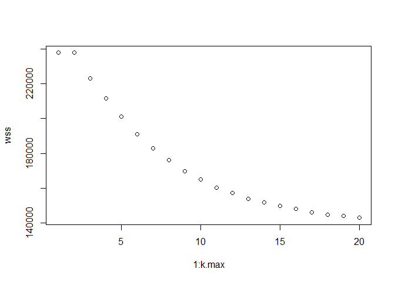
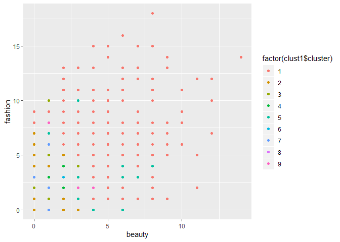
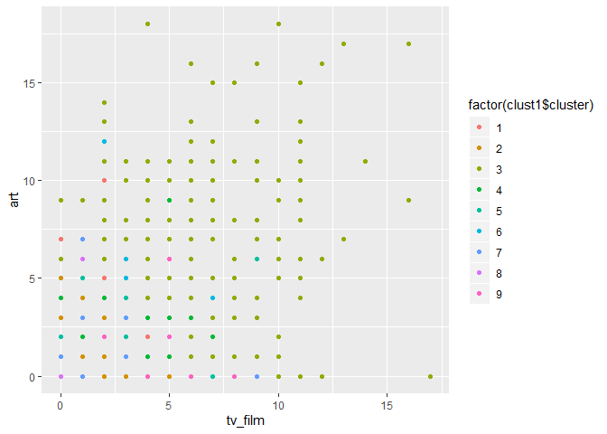
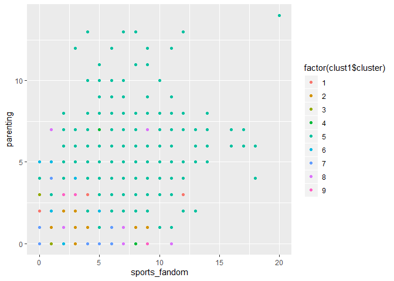
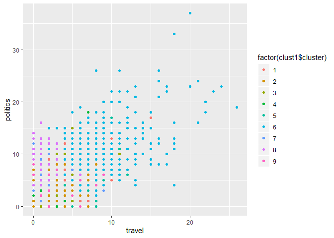
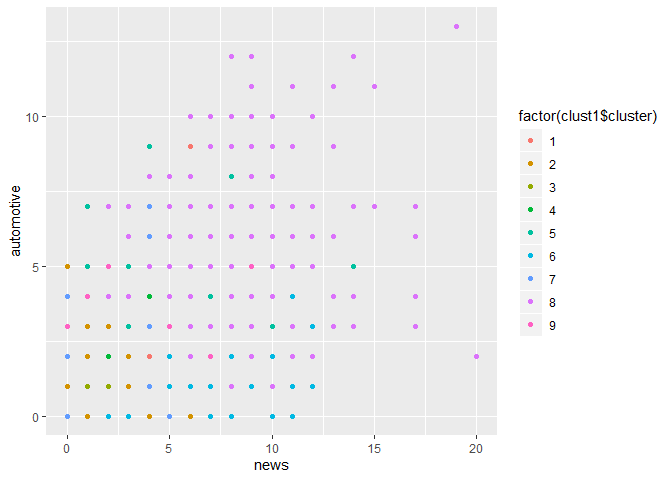
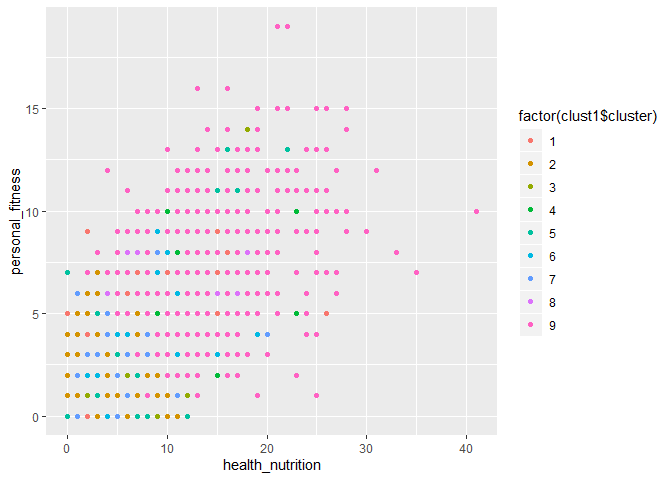
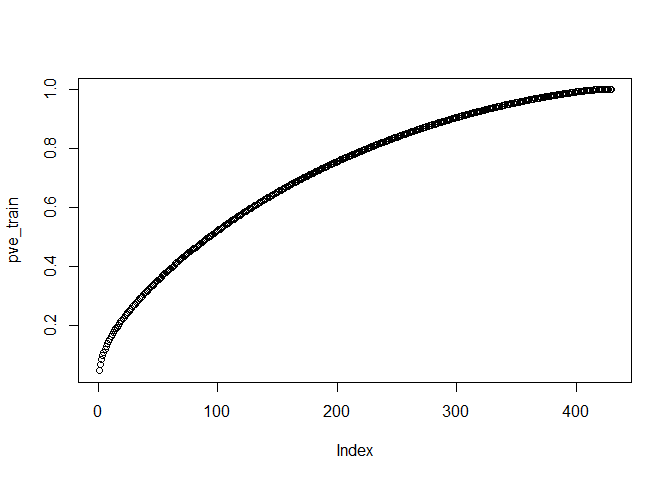
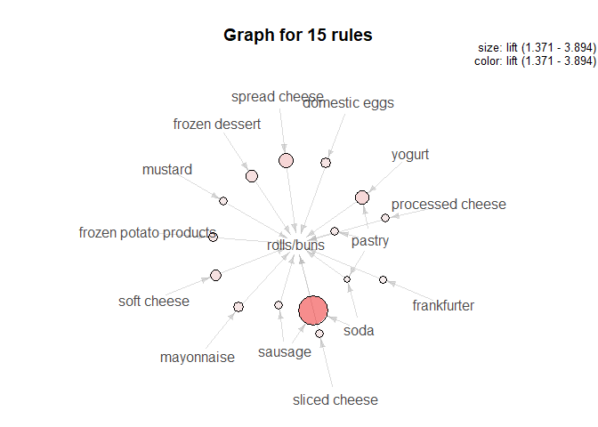
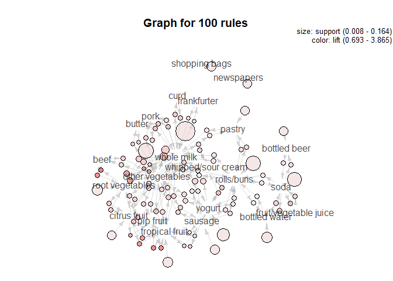

## **QUESTION 4 - MARKET SEGMENTATION**


### Reading the file


```r
rm(list = ls())
library(ggplot2)
setwd("D:/Summer Semester/Intro to Predictive Modelling/Unsupervised/data")
filename = 'social_marketing.csv'
raw_data = read.csv(filename, header = TRUE)
rownames(raw_data) <- raw_data$X
raw_data = raw_data[,-c(1)]
summary(raw_data)
```


#### Getting chatter and uncategorized into one group as they are proxies for each other.
#### Getting spam and adult into one group as they both are most likely from bots.


```r
raw_data$nocat = raw_data$chatter + raw_data$uncategorized
raw_data$bots = raw_data$spam + raw_data$adult

raw_data = raw_data[,-c(1,5,35,36)]
```

### Scaling the data


```r
scaled_data = raw_data[,-c(1)]
scaled_data = scale(scaled_data)
```

### Calculating the mean and standard deviation for the columns


```r
mu = attr(scaled_data,"scaled:center")
sigma = attr(scaled_data,"scaled:scale")
```


#### Trying "elbow method" to get the best value for k. Tot.withinss gives the total within cluster sum of squares


```r
set.seed(21)
k.max = 20
data = scaled_data
wss = sapply(1:k.max, function(k){kmeans(data,k,nstart = 50,iter.max = 20)$tot.withinss})
plot(1:k.max, wss)
```

<!-- -->

```r
wss
```

```
##  [1] 260073.0 237789.6 223182.0 211660.1 201087.1 191054.7 182766.5
##  [8] 176131.7 169838.7 165059.6 160424.7 157127.0 153989.0 151758.5
## [15] 149748.1 147936.6 146186.4 144895.7 143589.6 142312.0
```


#### Here we are trying to initialize using kmeans++ and the withinss is the same for both kmeans and kmeans++. Hence we are just going to take k means


```r
library(LICORS)  # for kmeans++
k.max = 20
data = scaled_data
wss = sapply(1:k.max, function(k){kmeanspp(data, k, nstart=25)$tot.withinss})
plot(1:k.max, wss)
```

<!-- -->

```r
wss
```

```
##  [1] 237789.6 237789.6 223182.0 211660.1 201087.0 191054.7 182766.5
##  [8] 176131.7 169838.7 165059.6 160424.7 157126.8 153989.0 151758.5
## [15] 149748.0 147980.9 146187.4 144882.8 144069.1 142948.1
```


#### From the elbow chart we saw that k=9 is the good option to consider. Getting the clusters for k = 9


```r
set.seed(11)


cluster_cnt = 9
clust1 = kmeans(scaled_data, cluster_cnt, nstart=50,iter.max = 20)
clust1$center
```

```
##        travel photo_sharing      tv_film sports_fandom    politics
## 1 -0.04990067    1.24424155 -0.143681527    -0.2057617 -0.12328623
## 2 -0.21980424   -0.42728628 -0.217632578    -0.3219966 -0.30314663
## 3  0.22521994   -0.06793148  2.797494033    -0.1110163 -0.09398912
## 4 -0.03233067   -0.01712513  0.098292888    -0.1270605 -0.16945335
## 5 -0.10191634   -0.09478554 -0.098555364     2.1115073 -0.22357645
## 6  3.25418305   -0.11586843 -0.078034097    -0.2110138  3.10213293
## 7 -0.19368891    1.07870041 -0.148492384    -0.2116266 -0.14372147
## 8 -0.18101167   -0.21864845 -0.004694241     0.6613563  1.22136912
## 9 -0.15853987   -0.11923212 -0.138137930    -0.1917353 -0.20003892
##          food      family home_and_garden         music        news
## 1 -0.20750798  0.03776568      0.12682091  0.5369786372 -0.07808424
## 2 -0.36129497 -0.30594513     -0.20323568 -0.2252043756 -0.30762388
## 3  0.14130274 -0.12641145      0.34259576  1.0013972685  0.02205787
## 4 -0.09558135  0.21339985      0.07373505 -0.0553846418 -0.19303857
## 5  1.85815327  1.52169271      0.16670633  0.0284565442 -0.11121492
## 6  0.15371770 -0.08872519      0.03884360 -0.0441415072  1.13309518
## 7 -0.29980413 -0.05010846      0.13715761  0.1368480366 -0.27968374
## 8 -0.15868100  0.23261227      0.16674351 -0.0863982210  2.66128021
## 9  0.47207101 -0.08674320      0.14160609 -0.0008580502 -0.06808499
##   online_gaming    shopping health_nutrition college_uni sports_playing
## 1   -0.02984208  0.21026742      -0.05556193 -0.02567212     0.19335693
## 2   -0.23233759 -0.39501313      -0.31434705 -0.25848847    -0.26513015
## 3   -0.17142571  0.05633627      -0.16221380  0.36036615     0.11168622
## 4    3.56782041 -0.12311801      -0.17867598  3.28405314     2.13247614
## 5   -0.07550353 -0.02061932      -0.14129644 -0.13043219     0.11057066
## 6   -0.15841385 -0.07977338      -0.16500577 -0.03798320     0.03491642
## 7   -0.16480686  1.32627181      -0.23132895 -0.09561379    -0.03900935
## 8   -0.12163352 -0.18454453      -0.24303154 -0.19205889    -0.08809394
## 9   -0.11646549 -0.07128939       2.22944463 -0.21393141    -0.03588990
##       cooking         eco   computers    business    outdoors      crafts
## 1  2.82528869  0.01635616  0.07413662  0.23071862  0.02530721  0.08725987
## 2 -0.32647231 -0.26843085 -0.25560067 -0.24675449 -0.32455986 -0.29211499
## 3 -0.13471492  0.09902520 -0.15916460  0.33957022 -0.07597983  0.76060484
## 4 -0.12096141 -0.06651131 -0.07928952 -0.10177238 -0.14414097  0.03499493
## 5 -0.09695308  0.17811788  0.09309559  0.11513311 -0.06614947  0.70316398
## 6 -0.18837384  0.17614190  2.91751022  0.54821721 -0.03458032  0.20301368
## 7 -0.23834586  0.28204133 -0.03668530  0.33534796 -0.23680755  0.07801835
## 8 -0.23501694 -0.09117140 -0.19115868 -0.11648280  0.30983326 -0.16394060
## 9  0.40975111  0.55747157 -0.08664933  0.04315869  1.73209124  0.07303923
##    automotive          art    religion       beauty   parenting
## 1  0.01974962 -0.001733172 -0.13325379  2.618732073 -0.06720369
## 2 -0.30851809 -0.233499241 -0.29859294 -0.273765679 -0.32072306
## 3 -0.22411487  2.700011162  0.01398937  0.007952198 -0.18835776
## 4  0.06557030  0.281372220 -0.18618805 -0.227707330 -0.12956654
## 5  0.11695593 -0.020856740  2.30488851  0.328985570  2.17123449
## 6 -0.13732889 -0.161296113  0.11199530 -0.178887599  0.02030735
## 7  0.07176155 -0.195418365 -0.26009051 -0.181992110 -0.18659807
## 8  2.58820243 -0.162108399 -0.17917650 -0.177154209  0.02899513
## 9 -0.17950439 -0.069243103 -0.15590540 -0.204500833 -0.08127626
##        dating       school personal_fitness     fashion small_business
## 1  0.01555759  0.153593523      -0.03598254  2.70584957     0.16407652
## 2 -0.18331361 -0.323301197      -0.33102552 -0.29271144    -0.21522806
## 3 -0.08542484 -0.037455240      -0.15789299 -0.01994885     0.84368210
## 4 -0.01544416 -0.218273271      -0.18402332 -0.07256874     0.11197922
## 5  0.02278967  1.701852833      -0.09185812  0.02209992     0.09006902
## 6  0.30130337 -0.110311653      -0.14760381 -0.17067672     0.40375446
## 7  0.38076365  0.107243044      -0.19055036 -0.06623577     0.20872040
## 8 -0.04427631  0.006534272      -0.23252845 -0.21335066    -0.15464807
## 9  0.17537400 -0.168305216       2.17576539 -0.10922015    -0.12913686
##         nocat         bots
## 1  0.09220543  0.011817768
## 2 -0.39839165  0.013391891
## 3  0.05650398 -0.012644003
## 4 -0.08325333 -0.008343898
## 5 -0.14434993  0.018477499
## 6 -0.10032085 -0.091071162
## 7  1.43932133  0.007298320
## 8 -0.08824321 -0.099443133
## 9 -0.09424667  0.016475611
```

```r
i = 1

for (i  in (1:cluster_cnt)){
  cat (length(which(clust1$cluster == i)),"\n")
}
```

```
## 482 
## 3340 
## 401 
## 360 
## 676 
## 355 
## 1068 
## 432 
## 768
```


### Understanding cluster 1

#### The centroid of cluster 1 have high scores in photo sharing, cooking, beauty, fashion and have moderatley high scores in music and shopping

#### We can infer from these factors that this cluster is for "younger women"


```r
qplot(beauty, fashion, data=raw_data, color=factor(clust1$cluster))
```

<!-- -->


### Understanding cluster 2

#### The centroid of cluster 2 have negative z-value between -0.25 and -0.5 for almost all factors. And this cluster has close to 42% of the entire population. This is the cluster where all the "uncategorized people" fall under


### Understanding cluster 3

#### The centroid of cluster 3 have high z-value for tv film, music, art and have moderately high score for crafts, home and garden and small businesses

#### We can infer from these factors that this cluster is people who are into different kinds of "arts and crafts"


```r
qplot(tv_film, art, data=raw_data, color=factor(clust1$cluster))
```

<!-- -->

### Understanding cluster 4

#### The centroid of cluster 4 have high z-value for online gaming, college uni and sports playing

#### We can infer from these factors as these are most probably " university students"


```r
qplot(online_gaming, college_uni, data=raw_data, color=factor(clust1$cluster))
```

<!-- -->


### Understanding cluster 5

#### The centroid of cluster 5 have high z-value for sports fandom, food, family, nutrition, religion,parenting and school

#### We can infer from these factors that this cluster is most probably "parents with kids who go to school"


```r
qplot(sports_fandom, parenting, data=raw_data, color=factor(clust1$cluster))
```

<!-- -->


### Understanding cluster 6

#### The centroid of cluster 6 have high scores in travel, politics, news, computers and have moderately high scores in business and small business

#### We can infer from these factors that this cluster is for "business professionals" who are updated with what's currently happeing in the world


```r
qplot(travel, politics, data=raw_data, color=factor(clust1$cluster))
```

<!-- -->


### Understanding cluster 7

#### The centroid of cluster 7 have high scores for photo sharing, shopping, no category and have moderately high scores for eco, business, dating and small business

#### We can infer from these factors that this cluster is from "middle aged women who are active on the internet" and tweet about a lot of different things


```r
qplot(photo_sharing, shopping, data=raw_data, color=factor(clust1$cluster))
```

<!-- -->

### Understanding cluster 8

#### The centroid of cluster 8 have high scores in sports fandom, politics, news, automotives and have moderately high scores in outdoors and family

#### We can infer from these factors that this cluster is with "middle aged men" without school going kids


```r
qplot(news, automotive, data=raw_data, color=factor(clust1$cluster))
```

<!-- -->

### Understanding cluster 9

#### The centroid of cluster 9 have high z-value for health nutrition, outdoors, personal fitness and have moderately high score for food and eco 

#### We can infer from these factors that this cluster is "fitness enthusiasts" who love working out


```r
qplot(health_nutrition, personal_fitness, data=raw_data, color=factor(clust1$cluster))
```

<!-- -->


## **QUESTION 5 - AUTHOR ATTRIBUTION**


### IMPORTING NECESSARY LIBRARIES


```r
rm(list = ls())

library(tm) 
```

```
## Loading required package: NLP
```

```
## 
## Attaching package: 'NLP'
```

```
## The following object is masked from 'package:ggplot2':
## 
##     annotate
```

```r
library(magrittr)
library(slam)
library(proxy)
```

```
## 
## Attaching package: 'proxy'
```

```
## The following objects are masked from 'package:stats':
## 
##     as.dist, dist
```

```
## The following object is masked from 'package:base':
## 
##     as.matrix
```

```r
library(tibble)
library(dplyr)
```

```
## 
## Attaching package: 'dplyr'
```

```
## The following objects are masked from 'package:stats':
## 
##     filter, lag
```

```
## The following objects are masked from 'package:base':
## 
##     intersect, setdiff, setequal, union
```


### SETTING THE READER FUNCTION AND WORKING DIRECTORY

```r
readerPlain = function(fname){
				readPlain(elem=list(content=readLines(fname)), 
							id=fname, language='en') }

setwd("D:/Summer Semester/Intro to Predictive Modelling/Unsupervised/data/ReutersC50")
```

### Getting the names of all 2500 files. First we got the list of all 50 directories and then got the list of the .txt files in them.
### At the end we applied the reader function on these files


```r
## For train data
 
dirs_list_train = list.dirs('D:/Summer Semester/Intro to Predictive Modelling/Unsupervised/data/ReutersC50/C50train',recursive = FALSE)

file_list_train = character()

for(i in dirs_list_train){
  xx = Sys.glob(paste(i,'/*txt',sep = ''))
  file_list_train = c(xx,file_list_train)
}

routers_train = lapply(file_list_train, readerPlain) 


## For test data
 
dirs_list_test = list.dirs('D:/Summer Semester/Intro to Predictive Modelling/Unsupervised/data/ReutersC50/C50test',recursive = FALSE)

file_list_test = character()

for(i in dirs_list_test){
  xx = Sys.glob(paste(i,'/*txt',sep = ''))
  file_list_test = c(xx,file_list_test)
}

routers_test = lapply(file_list_test, readerPlain) 
```


### Cleaning up file names


```r
## Train files

mynames_train = file_list_train %>%
	{ strsplit(., '/', fixed=TRUE) } %>%
	{ lapply(., tail, n=2) } %>%
	{ lapply(., paste0, collapse = '') } %>%
	unlist

head(mynames_train)
```

```
## [1] "WilliamKazer101226newsML.txt" "WilliamKazer10321newsML.txt" 
## [3] "WilliamKazer105226newsML.txt" "WilliamKazer106731newsML.txt"
## [5] "WilliamKazer108094newsML.txt" "WilliamKazer113095newsML.txt"
```

```r
## Test files

mynames_test = file_list_test %>%
	{ strsplit(., '/', fixed=TRUE) } %>%
	{ lapply(., tail, n=2) } %>%
	{ lapply(., paste0, collapse = '') } %>%
	unlist

head(mynames_test)
```

```
## [1] "WilliamKazer305704newsML.txt" "WilliamKazer316238newsML.txt"
## [3] "WilliamKazer320093newsML.txt" "WilliamKazer323030newsML.txt"
## [5] "WilliamKazer323194newsML.txt" "WilliamKazer326930newsML.txt"
```

### Renaming the articles and creating a corpus of all documents


```r
## For train data

names(routers_train) = mynames_train
documents_raw_train = Corpus(VectorSource(routers_train))


## For test data

names(routers_test) = mynames_test
documents_raw_test = Corpus(VectorSource(routers_test))
```


### Cleaning the documents


```r
## For train data

my_documents_train = documents_raw_train
my_documents_train = tm_map(my_documents_train, content_transformer(tolower)) # make everything lowercase
```

```
## Warning in tm_map.SimpleCorpus(my_documents_train,
## content_transformer(tolower)): transformation drops documents
```

```r
my_documents_train = tm_map(my_documents_train, content_transformer(removeNumbers)) # remove numbers
```

```
## Warning in tm_map.SimpleCorpus(my_documents_train,
## content_transformer(removeNumbers)): transformation drops documents
```

```r
my_documents_train = tm_map(my_documents_train, content_transformer(removePunctuation)) # remove punctuation
```

```
## Warning in tm_map.SimpleCorpus(my_documents_train,
## content_transformer(removePunctuation)): transformation drops documents
```

```r
my_documents_train = tm_map(my_documents_train, content_transformer(stripWhitespace)) ## remove excess white-space
```

```
## Warning in tm_map.SimpleCorpus(my_documents_train,
## content_transformer(stripWhitespace)): transformation drops documents
```

```r
my_documents_train = tm_map(my_documents_train, content_transformer(removeWords), stopwords("en"))
```

```
## Warning in tm_map.SimpleCorpus(my_documents_train,
## content_transformer(removeWords), : transformation drops documents
```

```r
## stemming the words
my_documents_train = tm_map(my_documents_train, content_transformer(stemDocument),language="english")
```

```
## Warning in tm_map.SimpleCorpus(my_documents_train,
## content_transformer(stemDocument), : transformation drops documents
```

```r
## For test data

my_documents_test = documents_raw_test
my_documents_test = tm_map(my_documents_test, content_transformer(tolower)) # make everything lowercase
```

```
## Warning in tm_map.SimpleCorpus(my_documents_test,
## content_transformer(tolower)): transformation drops documents
```

```r
my_documents_test = tm_map(my_documents_test, content_transformer(removeNumbers)) # remove numbers
```

```
## Warning in tm_map.SimpleCorpus(my_documents_test,
## content_transformer(removeNumbers)): transformation drops documents
```

```r
my_documents_test = tm_map(my_documents_test, content_transformer(removePunctuation)) # remove punctuation
```

```
## Warning in tm_map.SimpleCorpus(my_documents_test,
## content_transformer(removePunctuation)): transformation drops documents
```

```r
my_documents_test = tm_map(my_documents_test, content_transformer(stripWhitespace)) ## remove excess white-space
```

```
## Warning in tm_map.SimpleCorpus(my_documents_test,
## content_transformer(stripWhitespace)): transformation drops documents
```

```r
my_documents_test = tm_map(my_documents_test, content_transformer(removeWords), stopwords("en"))
```

```
## Warning in tm_map.SimpleCorpus(my_documents_test,
## content_transformer(removeWords), : transformation drops documents
```

```r
## stemming the words
my_documents_test = tm_map(my_documents_test, content_transformer(stemDocument),language="english")
```

```
## Warning in tm_map.SimpleCorpus(my_documents_test,
## content_transformer(stemDocument), : transformation drops documents
```


### Creating the document term matrix and removing sparse data from the train. We are removing terms with count 0 in more than 90% of the docs


```r
## For train data
DTM_routers_train = DocumentTermMatrix(my_documents_train)
DTM_routers_train
```

```
## <<DocumentTermMatrix (documents: 2500, terms: 22481)>>
## Non-/sparse entries: 503483/55699017
## Sparsity           : 99%
## Maximal term length: 65
## Weighting          : term frequency (tf)
```

```r
DTM_routers_train = removeSparseTerms(DTM_routers_train, 0.90)
DTM_routers_train
```

```
## <<DocumentTermMatrix (documents: 2500, terms: 429)>>
## Non-/sparse entries: 255310/817190
## Sparsity           : 76%
## Maximal term length: 13
## Weighting          : term frequency (tf)
```
### The entries fell from 80Million to 800K


### Creating the document term matrix for test data now

```r
## For test data
#DTM_routers_test = DocumentTermMatrix(my_documents_test)
#DTM_routers_test

DTM_routers_test = DocumentTermMatrix(my_documents_test, control = list
               (dictionary=Terms(DTM_routers_train)) )

DTM_routers_test
```

```
## <<DocumentTermMatrix (documents: 2500, terms: 429)>>
## Non-/sparse entries: 256690/815810
## Sparsity           : 76%
## Maximal term length: 13
## Weighting          : term frequency (tf)
```


### Getting the TF-IDF matrix


```r
## For train data
N_train = nrow(DTM_routers_train)
DTM_routers_train = as.matrix(DTM_routers_train)
TF_mat = DTM_routers_train/rowSums(DTM_routers_train)
IDF_vec = log(1 + N_train/colSums(DTM_routers_train > 0))
TFIDF_mat_train = sweep(TF_mat, MARGIN=2, STATS=IDF_vec, FUN="*")  


## For test data
N_test = nrow(DTM_routers_test)
DTM_routers_test = as.matrix(DTM_routers_test)
TF_mat = DTM_routers_test/rowSums(DTM_routers_test)
IDF_vec = log(1 + N_test/colSums(DTM_routers_test > 0))
TFIDF_mat_test = sweep(TF_mat, MARGIN=2, STATS=IDF_vec, FUN="*")
```

### PCA on the TFIDF weights for train data:


```r
pc_routers_train = prcomp(TFIDF_mat_train, scale=TRUE)
pve_train = summary(pc_routers_train)$importance[3,]
plot(pve_train)  
```

<!-- -->


### There is no proper elbow. We are going to consider 140 parameters, which explain close to 60% of the variance


### Selecting only 140 components for test and 
making predictions on test set by using model generated principal components:


```r
train = pc_routers_train$x[,1:140]
test = predict(pc_routers_train,newdata =TFIDF_mat_test )[,1:140]
```


### Now we have the X's for test and train sorted. We need to get the Y's now. That is the authors name


```r
train_authors = file_list_train %>%
	{ strsplit(., '/', fixed=TRUE) } %>%
	{ lapply(., tail, n=2) } %>%
  { lapply(., head, n=1) } %>%
	{ lapply(., paste0, collapse = '') } %>%
	unlist

test_authors = file_list_test %>%
	{ strsplit(., '/', fixed=TRUE) } %>%
	{ lapply(., tail, n=2) } %>%
  { lapply(., head, n=1) } %>%
	{ lapply(., paste0, collapse = '') } %>%
	unlist
```


### Doing multi class logistic regression using the nnet package.
### Fitting the model and checking the accuracy


```r
library(nnet)
 
logistic_fit = nnet::multinom(train_authors~.,data = as.data.frame(train),MaxNWts = 10000)
```

```
## # weights:  7100 (6909 variable)
## initial  value 9780.057514 
## iter  10 value 1083.358103
## iter  20 value 67.915880
## iter  30 value 43.795472
## iter  40 value 20.205255
## iter  50 value 7.591846
## iter  60 value 3.093721
## iter  70 value 1.256817
## iter  80 value 0.591046
## iter  90 value 0.327729
## iter 100 value 0.194992
## final  value 0.194992 
## stopped after 100 iterations
```

```r
predicted.classes <- logistic_fit %>% predict(as.data.frame(test))
head(predicted.classes)
```

```
## [1] TheresePoletti GrahamEarnshaw WilliamKazer   ScottHillis   
## [5] WilliamKazer   MureDickie    
## 50 Levels: AaronPressman AlanCrosby AlexanderSmith ... WilliamKazer
```

```r
cat(" The accuracy from Multi Class logistic regression is \n")
```

```
##  The accuracy from Multi Class logistic regression is
```

```r
mean(predicted.classes == test_authors)
```

```
## [1] 0.404
```

### The accuracy for Logistic Regression is 40.4%


### Fitting a Random Forest model


```r
library(randomForest)
```

```
## randomForest 4.6-14
```

```
## Type rfNews() to see new features/changes/bug fixes.
```

```
## 
## Attaching package: 'randomForest'
```

```
## The following object is masked from 'package:dplyr':
## 
##     combine
```

```
## The following object is masked from 'package:ggplot2':
## 
##     margin
```

```r
rf_fit = randomForest(as.factor(train_authors)~.,data =as.data.frame(train),ntree = 1000, mtry =  50, importance = TRUE)
rf_predicted = predict(rf_fit,newx = test, type = 'response')
cat(" The accuracy from Random Forests is \n")
```

```
##  The accuracy from Random Forests is
```

```r
mean(rf_predicted == test_authors)
```

```
## [1] 0.6672
```


### The accuracy for Random Forests is 67.5%


### Fitting a Naive Bayes Model


```r
library (naivebayes)
```

```
## naivebayes 0.9.6 loaded
```

```r
nb_fit =naive_bayes(as.factor(train_authors) ~., data=as.data.frame(train))
nb_pred = predict(nb_fit,test)

cat(" The accuracy from Naive Bayes Model is \n")
```

```
##  The accuracy from Naive Bayes Model is
```

```r
mean(nb_pred == test_authors)
```

```
## [1] 0.4476
```

### The accuracy for Naive Bayes Models are is 44.8%


###  Conclusion:

#### We see that the best model to predict the authors is random forests and we can predict the correct author with an accuracy of 67%


## **QUESTION 6 - ASSOCIATION RULE MINING**


### OPENING THE FILE

```r
rm(list=ls())
setwd("D:/Summer Semester/Intro to Predictive Modelling/Unsupervised/data")
filename = 'groceries.txt'
groceries_raw = read.csv(filename, header = FALSE)

head(groceries_raw)
```

```
##                 V1                  V2             V3
## 1     citrus fruit semi-finished bread      margarine
## 2   tropical fruit              yogurt         coffee
## 3       whole milk                                   
## 4        pip fruit              yogurt  cream cheese 
## 5 other vegetables          whole milk condensed milk
## 6       whole milk              butter         yogurt
##                         V4
## 1              ready soups
## 2                         
## 3                         
## 4             meat spreads
## 5 long life bakery product
## 6                     rice
```

### LOADING THE IMPORTANT LIBRARIES


### Getting the dataframe to the format required


```r
groceries_raw$basket = rownames(groceries_raw)


df1 =groceries_raw[,c(1,5)]
colnames(df1) <- c("items","basket")
df2 =groceries_raw[,c(2,5)]
colnames(df2) <- c("items","basket")
df3 =groceries_raw[,c(3,5)]
colnames(df3) <- c("items","basket")
df4 =groceries_raw[,c(4,5)]
colnames(df4) <- c("items","basket")


groceries <- rbind(df1,df2,df3,df4)
groceries = groceries[groceries$items != '',]
na.omit(groceries)
```


### Top 20 items in any basket


```r
groceries$items %>%
  summary(., maxsum=Inf) %>%
  sort(., decreasing=TRUE) %>%
  head(., 20) %>%
  barplot(., las=2, cex.names=0.6,ylab="Frequency", main = 'Top 20 items by Frequency')
```

<!-- -->


### Getting the variables into the transactions class


```r
groceries_new = split(x=groceries$items, f=groceries$basket)
groceries_new[[1]]
```

```
## [1] citrus fruit        semi-finished bread margarine          
## [4] ready soups        
## 170 Levels: abrasive cleaner artif. sweetener baby cosmetics ... baby food
```

```r
grocery_trans = as(groceries_new, "transactions")
```

### Getting all the rules with a support of .01 and confidence .05


```r
basketrules = apriori(grocery_trans, 
                     parameter=list(support=.005, confidence=.05))

arules::inspect(basketrules)
```

### Top 15 combinations of items which are usually bought together (Have high lift)


```r
arules::inspect(head(sort(basketrules, by = 'lift', decreasing = TRUE),15))
```

```
##      lhs                             rhs                support    
## [1]  {pip fruit}                  => {tropical fruit}   0.012683054
## [2]  {tropical fruit}             => {pip fruit}        0.012683054
## [3]  {root vegetables}            => {onions}           0.005295502
## [4]  {onions}                     => {root vegetables}  0.005295502
## [5]  {beef}                       => {root vegetables}  0.008695084
## [6]  {root vegetables}            => {beef}             0.008695084
## [7]  {citrus fruit}               => {tropical fruit}   0.012486925
## [8]  {tropical fruit}             => {citrus fruit}     0.012486925
## [9]  {pip fruit}                  => {citrus fruit}     0.008172071
## [10] {citrus fruit}               => {pip fruit}        0.008172071
## [11] {other vegetables}           => {onions}           0.007452929
## [12] {onions}                     => {other vegetables} 0.007452929
## [13] {root vegetables}            => {other vegetables} 0.025366109
## [14] {other vegetables}           => {root vegetables}  0.025366109
## [15] {root vegetables,whole milk} => {other vegetables} 0.008172071
##      confidence lift     count
## [1]  0.26075269 3.864800 194  
## [2]  0.18798450 3.864800 194  
## [3]  0.07555970 3.789381  81  
## [4]  0.26557377 3.789381  81  
## [5]  0.25775194 3.677774 133  
## [6]  0.12406716 3.677774 133  
## [7]  0.23464373 3.477820 191  
## [8]  0.18507752 3.477820 191  
## [9]  0.16801075 3.157116 125  
## [10] 0.15356265 3.157116 125  
## [11] 0.05990541 3.004306 114  
## [12] 0.37377049 3.004306 114  
## [13] 0.36194030 2.909216 388  
## [14] 0.20388860 2.909216 388  
## [15] 0.36127168 2.903842 125
```

#### We see fruits mostly repeating. If people are buying one type of fruit, they most probably are going to buy other kinds of fruits as well. Hence it is a good idea to have all the fruits placed together


### What are people buying along with the rolls/buns:

#### Earlier we saw that rolls/buns are the second most frequently bought items. So now we are seeing what are people buying along with rolls/buns.


```r
rollsbuns_basket =  apriori (grocery_trans, parameter=list (supp=0.001,conf = 0.001,minlen = 2), appearance = list(default="lhs",rhs="rolls/buns"))

arules::inspect(head(sort(rollsbuns_basket, by = 'lift', decreasing = TRUE),15))

plot(head(rollsbuns_basket, n = 15, by = "lift"), method = 'graph', measure  = c("lift"))
```

<!-- -->

#### We see that along with rolls/buns people tend to buy soda, sausages, cheeses more. So we should have the meat and cheeses sections close by the bakery section


### What are people buying the shopping bags for:

#### Earlier we saw that shopping bags are in the top 20 most frequently bought items. Let's checkout what these shoppig bags are for


```r
shoppingbags_basket =  apriori (grocery_trans, parameter=list (supp=0.001,conf = 0.001,minlen = 2), appearance = list(default="lhs",rhs="shopping bags"))
```


```r
arules::inspect(head(sort(shoppingbags_basket, by = 'lift', decreasing = TRUE),15))
```

```
##      lhs                           rhs             support     confidence
## [1]  {cake bar}                 => {shopping bags} 0.001242155 0.14615385
## [2]  {hygiene articles}         => {shopping bags} 0.002222803 0.10493827
## [3]  {pot plants}               => {shopping bags} 0.001111402 0.10000000
## [4]  {napkins}                  => {shopping bags} 0.003334205 0.09902913
## [5]  {white wine}               => {shopping bags} 0.001176778 0.09625668
## [6]  {chocolate}                => {shopping bags} 0.002811192 0.08811475
## [7]  {candy}                    => {shopping bags} 0.001634414 0.08503401
## [8]  {long life bakery product} => {shopping bags} 0.001895921 0.07880435
## [9]  {specialty bar}            => {shopping bags} 0.001307531 0.07434944
## [10] {specialty chocolate}      => {shopping bags} 0.001438285 0.07357860
## [11] {salty snack}              => {shopping bags} 0.001765167 0.07258065
## [12] {newspapers}               => {shopping bags} 0.003464958 0.06751592
## [13] {canned beer}              => {shopping bags} 0.003334205 0.06675393
## [14] {waffles}                  => {shopping bags} 0.001569038 0.06349206
## [15] {coffee}                   => {shopping bags} 0.002222803 0.05954466
##      lift     count
## [1]  2.307089 19   
## [2]  1.656487 34   
## [3]  1.578535 17   
## [4]  1.563209 51   
## [5]  1.519445 18   
## [6]  1.390922 43   
## [7]  1.342291 25   
## [8]  1.243954 29   
## [9]  1.173632 20   
## [10] 1.161464 22   
## [11] 1.145711 27   
## [12] 1.065762 53   
## [13] 1.053734 51   
## [14] 1.002244 24   
## [15] 0.939933 34
```

```r
plot(head(shoppingbags_basket, n = 15, by = "lift"), method = 'graph', measure  = c("lift"))
```

<!-- -->

### People who buy cakes, hygiene articles, pot plants etc tend to buy shopping bags with them. Placing shopping bags along the aisles which have these items is recommended


### Exploring the baskets which has citrus fruits


```r
citrus_basket =  apriori (grocery_trans, parameter=list (supp=0.001,conf = 0.001,minlen = 2), appearance = list(default="lhs",rhs="citrus fruit"))
```


```r
arules::inspect(head(sort(citrus_basket, by = 'lift', decreasing = TRUE),15))
```

```
##      lhs                                  rhs            support    
## [1]  {beef,tropical fruit}             => {citrus fruit} 0.001111402
## [2]  {pip fruit,tropical fruit}        => {citrus fruit} 0.003072699
## [3]  {turkey}                          => {citrus fruit} 0.001111402
## [4]  {tropical fruit}                  => {citrus fruit} 0.012486925
## [5]  {pip fruit,root vegetables}       => {citrus fruit} 0.001438285
## [6]  {root vegetables,tropical fruit}  => {citrus fruit} 0.001895921
## [7]  {pip fruit}                       => {citrus fruit} 0.008172071
## [8]  {other vegetables,tropical fruit} => {citrus fruit} 0.002549686
## [9]  {grapes}                          => {citrus fruit} 0.002288180
## [10] {beef,root vegetables}            => {citrus fruit} 0.001372908
## [11] {sausage,tropical fruit}          => {citrus fruit} 0.001242155
## [12] {beef}                            => {citrus fruit} 0.005099372
## [13] {chicken}                         => {citrus fruit} 0.004118724
## [14] {onions,other vegetables}         => {citrus fruit} 0.001111402
## [15] {tropical fruit,yogurt}           => {citrus fruit} 0.001111402
##      confidence lift     count
## [1]  0.2575758  4.840146  17  
## [2]  0.2422680  4.552496  47  
## [3]  0.2125000  3.993120  17  
## [4]  0.1850775  3.477820 191  
## [5]  0.1774194  3.333915  22  
## [6]  0.1726190  3.243711  29  
## [7]  0.1680108  3.157116 125  
## [8]  0.1645570  3.092215  39  
## [9]  0.1590909  2.989502  35  
## [10] 0.1578947  2.967024  21  
## [11] 0.1520000  2.856256  19  
## [12] 0.1511628  2.840523  78  
## [13] 0.1492891  2.805315  63  
## [14] 0.1491228  2.802190  17  
## [15] 0.1360000  2.555597  17
```

```r
plot(head(citrus_basket, n = 15, by = "lift"), method = 'graph', measure  = c("lift"))
```

<!-- -->

```

### We see that there are high chances of having beef/turkey with citrus fruits in the same basket. This is interesting, as citrus doesn't go well with either of those meets


### Plotting the assosciation rules


```r
plot(basketrules, by = "lift", method = 'graph')
```

```
## Warning: Unknown control parameters: by
```

```
## Warning: plot: Too many rules supplied. Only plotting the best 100 rules
## using 'support' (change control parameter max if needed)
```

<!-- -->


